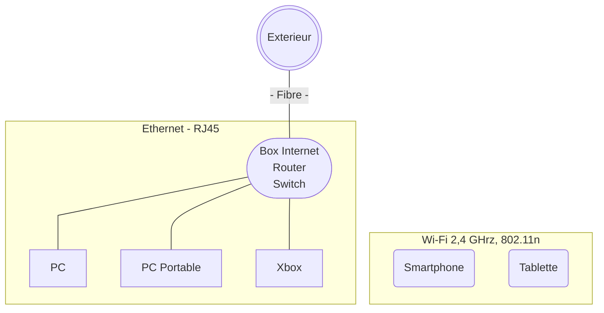
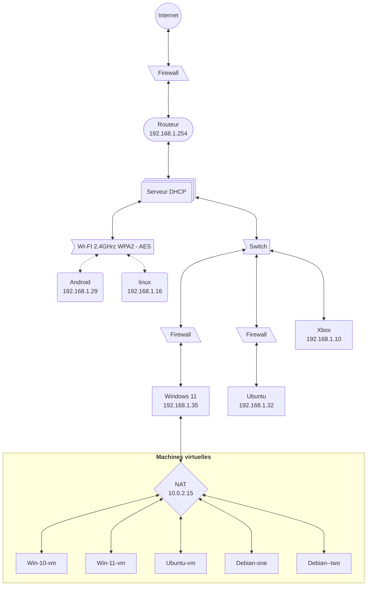

# Énoncé
> ⌨️ Challenge
>
> **Avec l’outil de votre choix (draw.io, par exemple) tentez de réaliser un diagramme réseau de votre réseau domestique.**  
>
> Essayez de n’oublier aucun équipement connecté au WiFi ou en filaire à votre box !
>
> **Bonus:** _vous pouvez aussi commencer à votre renseigner sur les adresses IP et le calcul de sous-réseaux. Il y a plein de vidéos qui traitent de ce sujet sur YouTube_ 😉

## Diagramme physique de mon réseau

## Diagramme logique de mon réseaux

