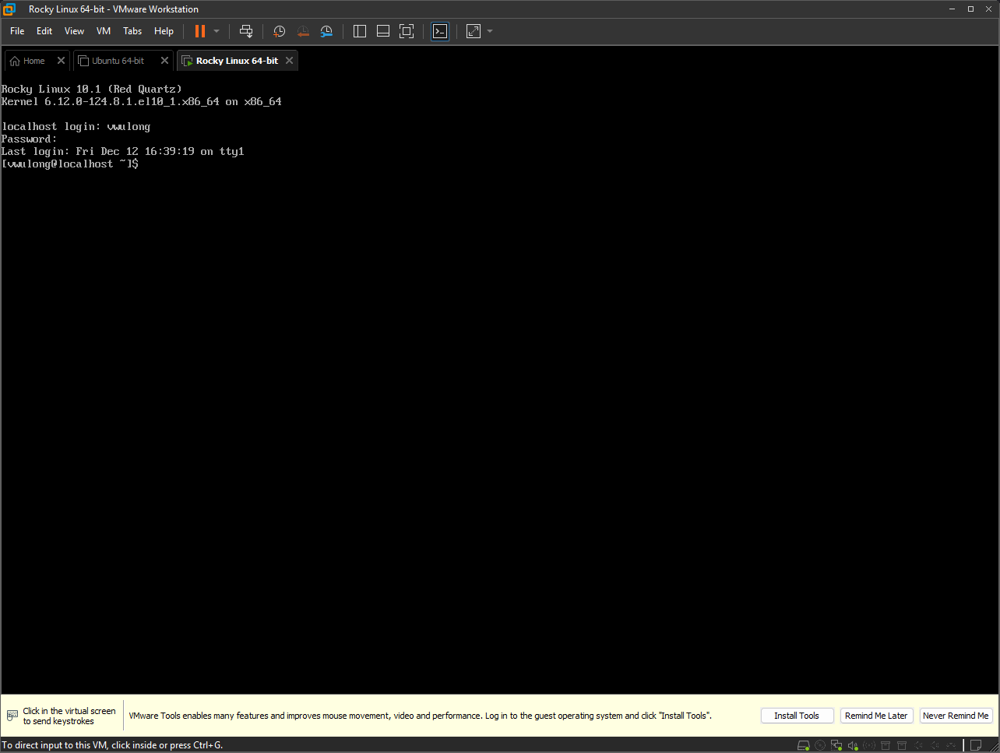
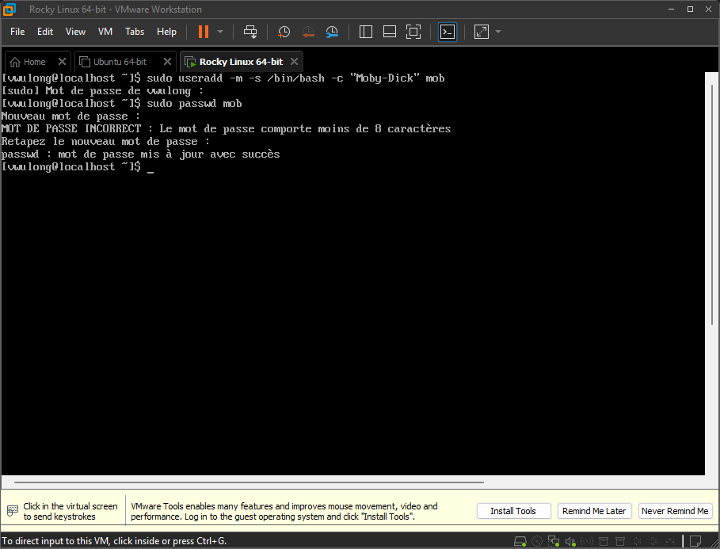
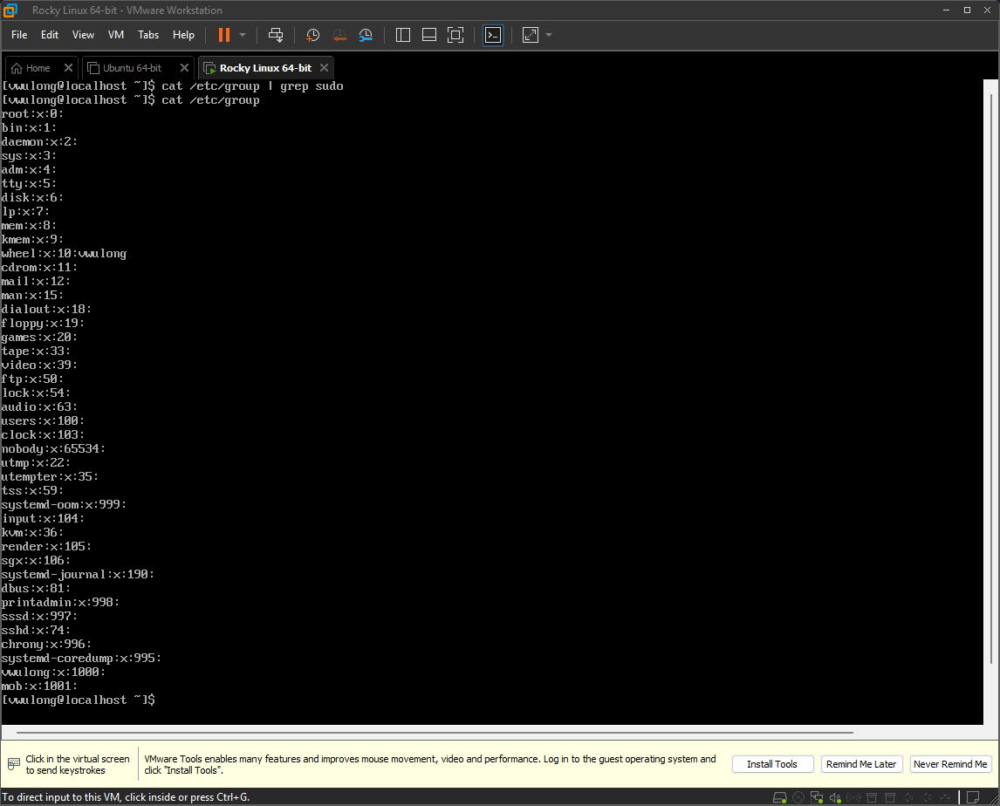
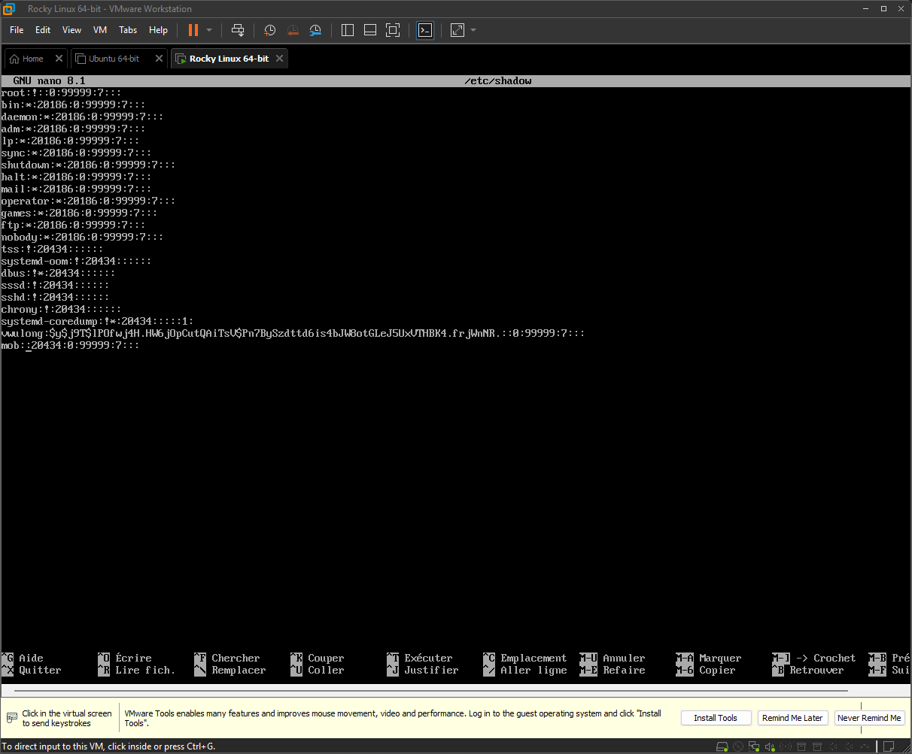
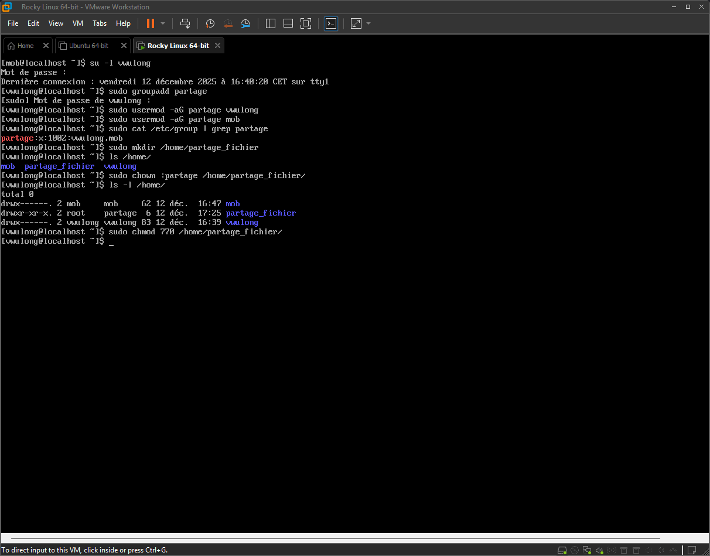

# Sécurité et administration

## Intitulé

> Pour pratiquer les notions du jour, votre mission est d’installer une VM Rocky Linux (le successeur de CentOS, la version communautaire de Red Hat Entreprise Linux).
>
> Sur cette VM, vous devez :
>
>   - créer un nouvel utilisateur
>   - permettre à cet utilisateur de lancer des commandes avec sudo
>   - faire en sorte qu’aucun mot de passe ne soit demandé pour lancer la commande rpm
>   - créer un groupe, mettre le nouvel utilisateur et l’utilisateur créé lors de l’installation dans ce groupe
>   - créer un dossier /home/partage_fichier et modifier ses permissions pour que les membres du groupe créé précédemment aient les droits de lecture et d’écriture, mais qu’aucun autre utilisateur du système n’y ait accès.
>   - créer un dernier utilisateur et vérifier qu’il n’a pas accès au dossier créé précédemment

## Cheminement

- J'installe Rocky Linux minimal version en laissant désactivé le compte Root et en accordant les droits administrateurs à l'User crée
- Je me connecte avec l'user crée

---

### Créer un utilisateur

- Je crée mon utilisatuer
- Je lui attribue un password, respectant les bonnes pratiques

---

### Permettre à cet utilisateur de lancer des commandes avec sudo

- Je liste les groupes, je ne vois pas le goupe sudo
- Je vois par contre que mon user avec les droits administrateur est lié au groupe wheel, j'en conclu que c'est le groupe pour la commande sudo

- J'ajoute mon user mob à ce groupe, je me connecte avec lui avec la commande `su -l mob`, je teste une commande avec sudo, c'est fonctionnel.

---

### Faire en sorte qu’aucun mot de passe ne soit demandé pour lancer la commande rpm

- Pour cela je reviens sur mon user administrateur, je vais dans le fichier /etc/shadow, j'efface comme un gros sac le hash de l'user mob

- Je sauvegarde, je me reco sur mob, et je test d'installer Vim

- On voit que sudo ne me demande pas de password !

---

###  Créer un groupe, mettre le nouvel utilisateur et l’utilisateur créé lors de l’installation dans ce groupe, créer un dossier /home/partage_fichier et modifier ses permissions pour que les membres du groupe créé précédemment aient les droits de lecture et d’écriture, mais qu’aucun autre utilisateur du système n’y ait accès.

- Je fais donc cela

---

### Créer un dernier utilisateur et vérifier qu’il n’a pas accès au dossier créé précédemment

- je crée un nouveau utilisateur nommé Batman

- On peut voir que batman n'a pas accès au dossier partage_fichier ! quel tocard ce Batman :smirk: :smirk:

> *je précise au cas où certains voudraient vérifier leur résultat en se basant sur mon truc, ma méthode pour que sudo ne demande pas de password n'est pas la bonne (de cette manière tout le monde peut se co à cette user), mais après avoir parler de respecter les bonnes pratiques je la trouvais marrante.*

