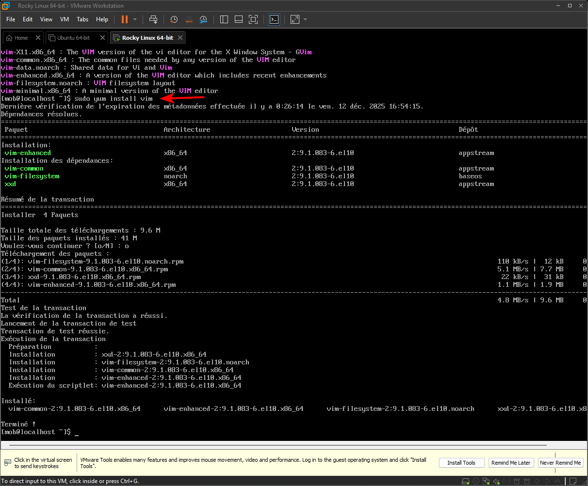
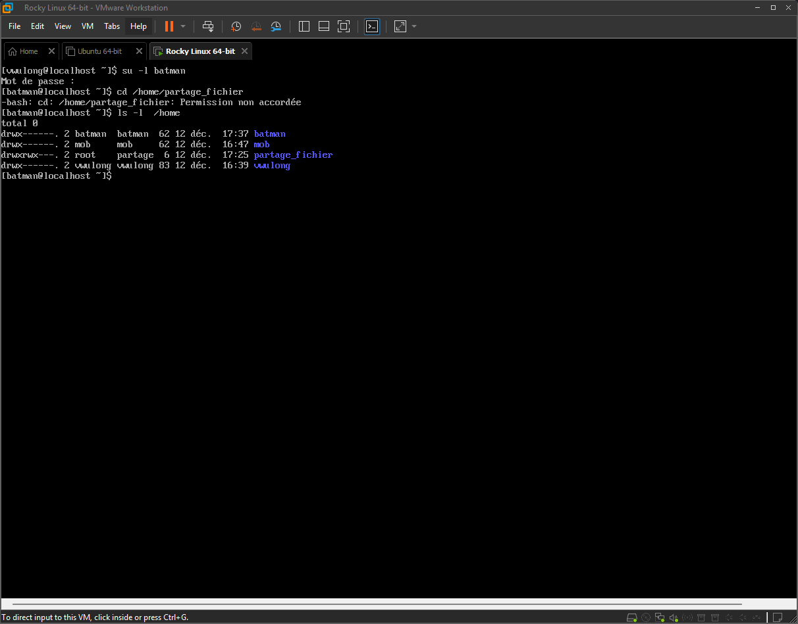

# Sécurité et administration

## Intitulé

> Pour pratiquer les notions du jour, votre mission est d’installer une VM Rocky Linux (le successeur de CentOS, la version communautaire de Red Hat Entreprise Linux).
>
> Sur cette VM, vous devez :
>
>   - créer un nouvel utilisateur
>   - permettre à cet utilisateur de lancer des commandes avec sudo
>   - faire en sorte qu’aucun mot de passe ne soit demandé pour lancer la commande rpm
>   - créer un groupe, mettre le nouvel utilisateur et l’utilisateur créé lors de l’installation dans ce groupe
>   - créer un dossier /home/partage_fichier et modifier ses permissions pour que les membres du groupe créé précédemment aient les droits de lecture et d’écriture, mais qu’aucun autre utilisateur du système n’y ait accès.
>   - créer un dernier utilisateur et vérifier qu’il n’a pas accès au dossier créé précédemment

## Cheminement

- J'installe Rocky Linux minimal version en laissant désactivé le compte Root et en accordant les droits administrateurs à l'User crée
- Je me connecte avec l'utilisateur crée

### Créer un utilisateur

- Je crée mon utilisatuer
- Je lui attribue un password, respectant les bonnes pratiques

### Permettre à cet utilisateur de lancer des commandes avec sudo

- Je liste les groupes, je ne vois pas le goupe sudo
- Je vois parcontre que mon user avec les droits administrateur est lié au groupe wheel, j'en conclu que c'est le groupe sudo

- J'ajoute mon user mob à ce groupe, je me connecte avec lui avec la commande `su -l mob`, je teste quelques commande avec sudo, c'est fonctionnel.

### Faire en sorte qu’aucun mot de passe ne soit demandé pour lancer la commande rpm

- Pour cela je reviens sur mon user administrateur, je vais dans le fichier /etc/shadow, j'efface comme un gros sac le hash de l'use mob

- je sauvegarde, je me reco sur mob, et je test d'installer Vim

- On voit Sudo ne me demande pas de password !

###  Créer un groupe, mettre le nouvel utilisateur et l’utilisateur créé lors de l’installation dans ce groupe, créer un dossier /home/partage_fichier et modifier ses permissions pour que les membres du groupe créé précédemment aient les droits de lecture et d’écriture, mais qu’aucun autre utilisateur du système n’y ait accès.

- Je fais donc cela

### Créer un dernier utilisateur et vérifier qu’il n’a pas accès au dossier créé précédemment

- je crée un nouveau utilisateur nommée Batman

