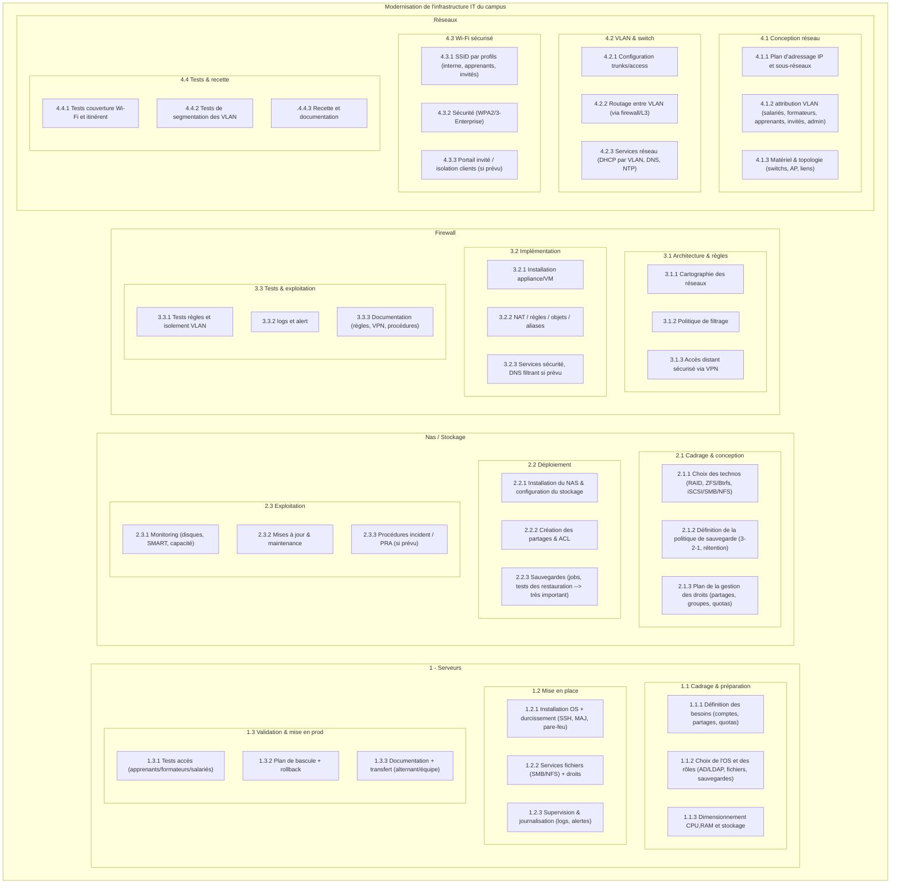

```mermaid
flowchart TD

  A["1. Modernisation infrastructure IT (Campus)"]

  %% Niveau 1 (grands lots)
  A --> S["1.1 Serveur(s)"]
  A --> N["1.2 NAS / Stockage"]
  A --> F["1.3 Firewall / Sécurité périmétrique"]
  A --> R["1.4 Réseau (VLAN + Wi-Fi sécurisé)"]

  %% Serveur(s) - Niveau 2/3
  S --> S1["1.1.1 Cadrage & préparation"]
  S1 --> S11["1.1.1.1 Recueil besoins (comptes, partages, quotas)"]
  S1 --> S12["1.1.1.2 Choix OS / rôles (AD/LDAP, fichiers, sauvegardes)"]
  S1 --> S13["1.1.1.3 Dimensionnement (CPU/RAM/stockage)"]

  S --> S2["1.1.2 Mise en place"]
  S2 --> S21["1.1.2.1 Installation OS + durcissement (SSH, MAJ, pare-feu)"]
  S2 --> S22["1.1.2.2 Services fichiers (SMB/NFS) + droits"]
  S2 --> S23["1.1.2.3 Supervision & journalisation (logs, alertes)"]

  S --> S3["1.1.3 Validation & mise en prod"]
  S3 --> S31["1.1.3.1 Tests accès (apprenants/formateurs/salariés)"]
  S3 --> S32["1.1.3.2 Plan de bascule + rollback"]
  S3 --> S33["1.1.3.3 Documentation + transfert (alternant/équipe)"]

  %% NAS - Niveau 2/3
  N --> N1["1.2.1 Cadrage & conception"]
  N1 --> N11["1.2.1.1 Choix techno (RAID, ZFS/Btrfs, iSCSI/SMB/NFS)"]
  N1 --> N12["1.2.1.2 Politique de sauvegarde (3-2-1, rétention)"]
  N1 --> N13["1.2.1.3 Plan de droits (partages, groupes, quotas)"]

  N --> N2["1.2.2 Déploiement"]
  N2 --> N21["1.2.2.1 Installation NAS + configuration stockage"]
  N2 --> N22["1.2.2.2 Création partages + ACL"]
  N2 --> N23["1.2.2.3 Sauvegardes (jobs, tests restauration)"]

  N --> N3["1.2.3 Exploitation"]
  N3 --> N31["1.2.3.1 Monitoring (disques, SMART, capacité)"]
  N3 --> N32["1.2.3.2 Mises à jour & maintenance"]
  N3 --> N33["1.2.3.3 Procédures incident / PRA (si prévu)"]

  %% Firewall - Niveau 2/3
  F --> F1["1.3.1 Architecture & règles"]
  F1 --> F11["1.3.1.1 Cartographie flux (LAN/WAN/Wi-Fi/VLAN)"]
  F1 --> F12["1.3.1.2 Politique filtrage (in/out, inter-VLAN)"]
  F1 --> F13["1.3.1.3 Accès distant sécurisé (VPN)"]

  F --> F2["1.3.2 Implémentation"]
  F2 --> F21["1.3.2.1 Installation appliance/VM + durcissement"]
  F2 --> F22["1.3.2.2 NAT / règles / objets / aliases"]
  F2 --> F23["1.3.2.3 Services sécurité (IDS/IPS, DNS filtrant si prévu)"]

  F --> F3["1.3.3 Tests & exploitation"]
  F3 --> F31["1.3.3.1 Tests règles + isolement VLAN"]
  F3 --> F32["1.3.3.2 Journalisation + alerting"]
  F3 --> F33["1.3.3.3 Documentation (règles, VPN, procédures)"]

  %% Réseau (VLAN + Wi-Fi) - Niveau 2/3
  R --> R1["1.4.1 Conception réseau"]
  R1 --> R11["1.4.1.1 Plan d’adressage IP + sous-réseaux"]
  R1 --> R12["1.4.1.2 Design VLAN (salariés, formateurs, apprenants, invités, admin)"]
  R1 --> R13["1.4.1.3 Matériel & topologie (switchs, AP, liens)"]

  R --> R2["1.4.2 VLAN & switching"]
  R2 --> R21["1.4.2.1 Configuration trunks/access"]
  R2 --> R22["1.4.2.2 Inter-VLAN routing (via firewall/L3)"]
  R2 --> R23["1.4.2.3 Services réseau (DHCP par VLAN, DNS, NTP)"]

  R --> R3["1.4.3 Wi-Fi sécurisé"]
  R3 --> R31["1.4.3.1 SSID par profils (interne, apprenants, invités)"]
  R3 --> R32["1.4.3.2 Sécurité (WPA2/3-Enterprise, RADIUS si prévu)"]
  R3 --> R33["1.4.3.3 Portail invité / isolation clients (si prévu)"]

  R --> R4["1.4.4 Tests & recette"]
  R4 --> R41["1.4.4.1 Tests couverture Wi-Fi + roaming"]
  R4 --> R42["1.4.4.2 Tests segmentation (interdits inter-VLAN)"]
  R4 --> R43["1.4.4.3 Recette + documentation (schémas, configs)"]
```

# Raccourcis

- [Challenge 2](#énoncé-e2)

# Énoncé E1
>
> ## Contexte
>
> Vous êtes responsable de l’informatique au sein d’un campus de formation professionnelle (en présentiel 😁).
>
> Le campus compte en permanence environ 500 personnes, entre les salariés (une quinzaine), les formateurs (freelances, formateurs occasionnels) et les apprenants (formation continue et alternance).
>
> La direction vous demande de moderniser l’infrastructure IT du campus pour accueillir de nouveaux services numériques : serveurs fichiers, NAS, firewall, VLAN et accès sécurisé Wi-Fi.
>
> Dans votre service, vous accueillez actuellement un alternant.
>
> ## Consignes
>
> Rédigez la fiche de cadrage du projet comprenant :
>
>   - Objectifs du projet
>   - Périmètre et exclusions
>   - Parties prenantes (interne / externe)
>   - Livrables principaux
>   - Contraintes Qualité / Coût / Délai
>
> ## Notes
>
>   - Vous pouvez rédiger votre document avec l’outil de votre choix (Google Doc, fichier Markdown…)
>   - Gardez bien le fichier : il servira pour la suite !
>   - Prenez le temps de chercher de la documentation sur le sujet
>   - On ne demande pas d’être exhaustif, chaque partie peut ne contenir que quelques points
>
# Fiche de cadrage

## Objectifs du projet
- Moderniser l’infrastructure informatique du campus afin de supporter les nouveaux usages numériques.
- Mettre en place une architecture réseau sécurisée intégrant :
    - un système de stockage centralisé (serveurs fichiers / NAS),
    - un firewall de nouvelle génération,
    - une segmentation réseau par VLAN,
    - un accès Wi-Fi sécurisé pour les apprenants, formateurs et personnel administratif.
- Améliorer la disponibilité, la sécurité et la performance des services informatiques.
- Préparer l’infrastructure à l’augmentation future du nombre d’utilisateurs et de services numériques.

## Périmètre du projet
### Inclus
- Audit de l’infrastructure existante.
- Conception de l’architecture réseau cible.
- Acquisition et déploiement :
  - firewall,
  - NAS / serveurs fichiers,
  - équipements réseau compatibles VLAN,
  - bornes Wi-Fi sécurisées.
- Configuration des VLAN (administration, pédagogie, invités, infrastructure).
- Mise en place des mécanismes d’authentification et de sécurité Wi-Fi.
- Documentation technique et transfert de compétences.
### Exclus
- Développement applicatif spécifique.
- Renouvellement du parc informatique utilisateur.
- Gestion du support utilisateurs après mise en production (hors phase projet).

## Parties prenantes
### Internes
- Direction du campus (sponsor du projet)
- Responsable informatique (chef de projet)
- Alternant IT (support technique projet)
- Personnel administratif
- Formateurs
- Apprenants
### Externes
- Fournisseurs matériels (réseau, NAS, firewall)
- Prestataires d’intégration / infogérance (si nécessaire)
- Opérateur Internet
- Mainteneurs des équipements

## Livrables principaux
- Étude d’existant et analyse des besoins.
- Dossier d’architecture technique cible.
- Plan d’adressage IP et plan VLAN.
- Infrastructure réseau déployée et opérationnelle.
- Documentation d’exploitation (procédures, schémas réseau).
- Rapport de recette et validation de mise en production.

## Contraintes Qualité / Coût / Délai
### Qualité
- Haute disponibilité des services critiques.
- Conformité aux bonnes pratiques de sécurité réseau.
- Documentation complète et maintenable.
- Performance réseau adaptée à ~500 utilisateurs simultanés.

### Coût
- Respect du budget validé par la direction.
- Optimisation des coûts via mutualisation des équipements et solutions adaptées.

### Délai
- Déploiement progressif sans interruption majeure de service.
- Mise en production complète dans le délai défini par la direction (ex. 4 à 6 mois).

## Méthode de gestion recommandée *(correction)*
Pour mener a bien ce projet, plusieurs méthodologies peuvent être combinées:

- **Cycle en V :** cette méthode séquentielle structure le projet en phases distincte (analyse des besoins, conception, réalisation, tests, validation). Elle permet de garantir que chaque étape est validée avant de passer à la suivante, ce qui est particulièrement adapté aux projets d'infrastructure où la sécurité et la fiabilité sont critiques.
- **Méthode Agile :** l'utilisation de sprints courts permet d'apporter de la flexibilité au projet. Des ajustements peuvent être réalisés rapidement en fonction des retours terrain ou des contraintes techniques découverte en cours de route
- **Approche DevOps :** cette approche favorise l'automatisation de la configuration des serveurs, du déploiment des services et des tests, Elle permet de gagner du temps, de réduire les erreurs humaines et d'assurer une mise en production plus rapide.

# Agile

> À faire également Lire le Manifeste pour le développement Agile de logiciels: https://agilemanifesto.org/iso/fr/manifesto.html
> 
> Commenter le Manifeste (questions, points positifs, critiques…) dans un fichier (libre choix de l’outil).

## WBS

# Énoncé E2

> ## Contexte
>
> Vous êtes responsable de l'informatique au sein d'un campus de formation professionnelle (en présentiel 😁).
>
> Le campus compte en permanence environ 500 personnes, entre les salariés (une quinzaine), les formateurs (freelances, formateurs occasionnels) et les apprenants (formation continue et alternance).
>
> La direction vous demande de moderniser l'infrastructure IT du campus pour accueillir de nouveaux services numériques : serveurs fichiers, NAS, firewall, VLAN et accès sécurisé Wi-Fi.
>
> Dans votre service, vous accueillez actuellement un alternant.
> ## Consignes
>
> Hier vous avez créé la note de cadrage du projet.
>
> Aujourd'hui on vous demande de créer un WBS avec plusieurs niveaux de tâches :
>
> - Niveau 1 : grands lots (serveur, NAS, firewall, réseau)
> - Niveau 2-3 : tâches et sous-tâches
>
> ## Notes
>
> - Vous pouvez utiliser les outils de votre choix pour la représentation graphique
> - Gardez bien le fichier : il servira pour la suite !
> - Prenez le temps de chercher de la documentation sur le sujet
>

